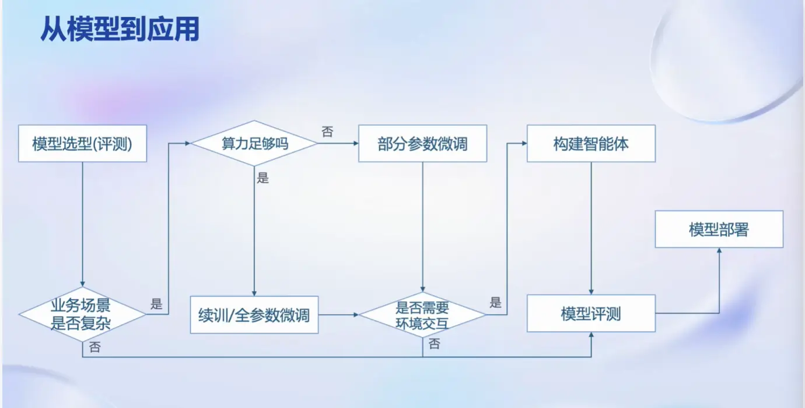
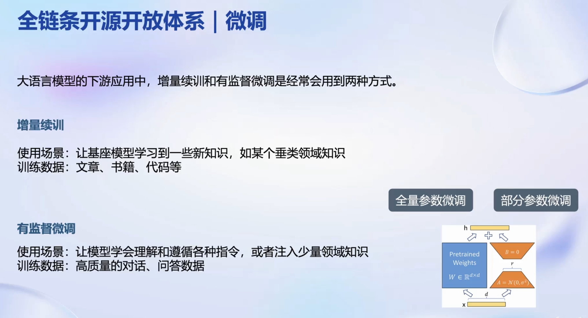
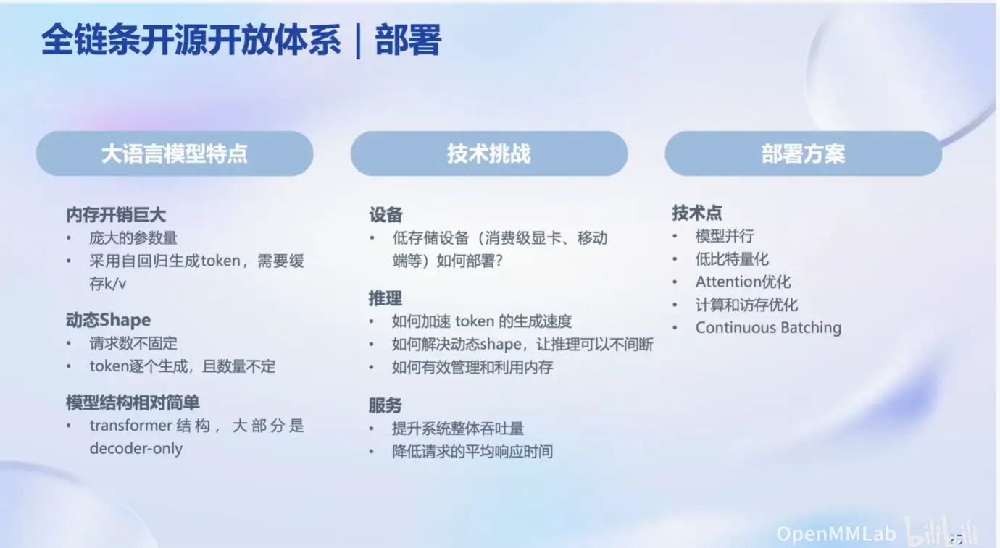
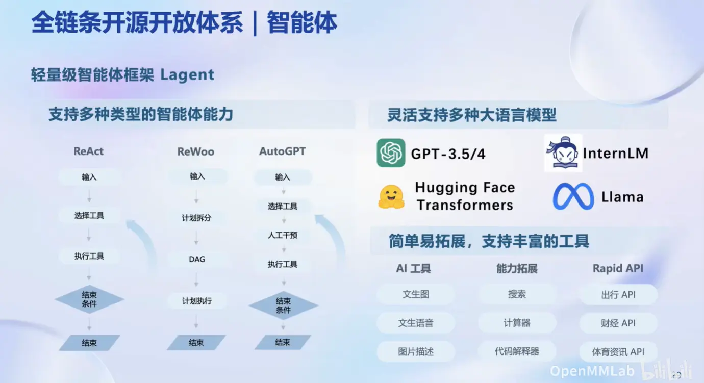
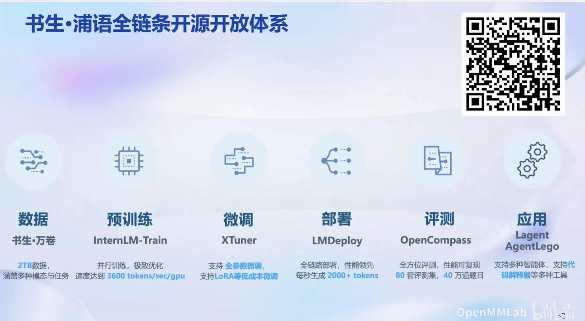

# 大模型第一课

特点：通用人工智能，应对多任务、多模态

大模型从模型到应用步骤：

大模型微调方法：

大模型部署：

延伸到构建智能体：

书生浦语全链条开源开放体系：

总结：第一节课详细介绍了书生·浦语大模型全链路开源开放体系，其中包括数据来源、如何进行预训练、使用XTuner进行微调、LMDeploy 部署平台、OpenCompass评测平台及AgentLego应用，让我初步了解了大模型从训练到应用部署的整个过程。
