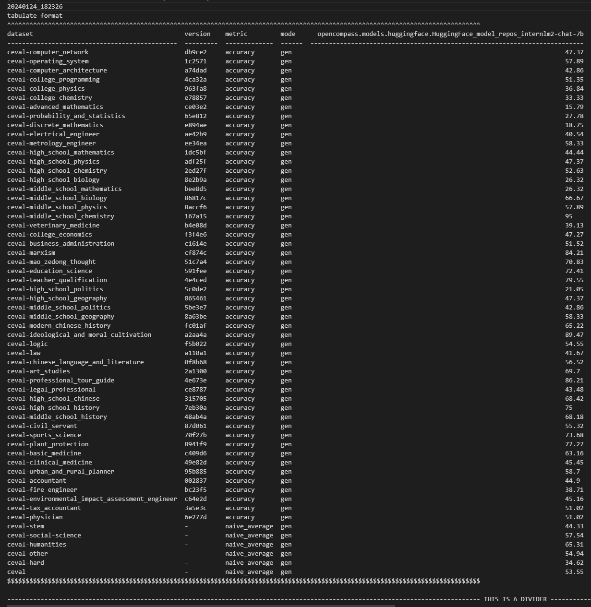

# lesson6 opencompass作业

`python run.py --datasets ceval_gen --hf-path /root/share/model_repos/internlm2-chat-7b/ --tokenizer-path /root/share/model_repos/internlm2-chat-7b/ --tokenizer-kwargs padding_side='left' truncation='left' trust_remote_code=True --model-kwargs trust_remote_code=True device_map='auto' --max-seq-len 2048 --max-out-len 16 --batch-size 4 --num-gpus 1 --debug`

运行上述这条命令，model为internlm2-chat-7b，数据集为ceval_gen

结果展示：

